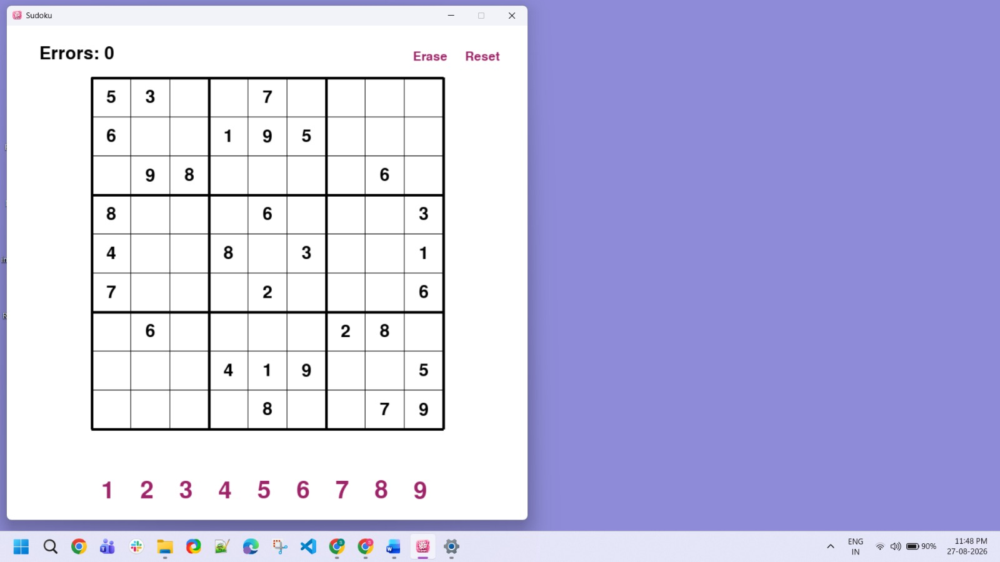
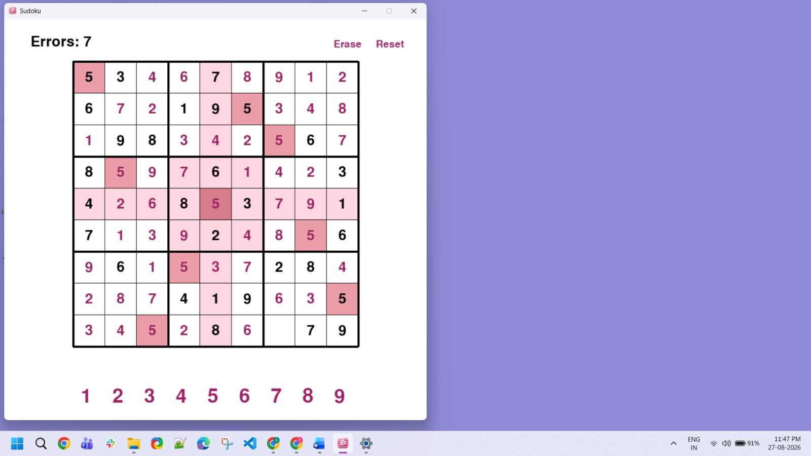
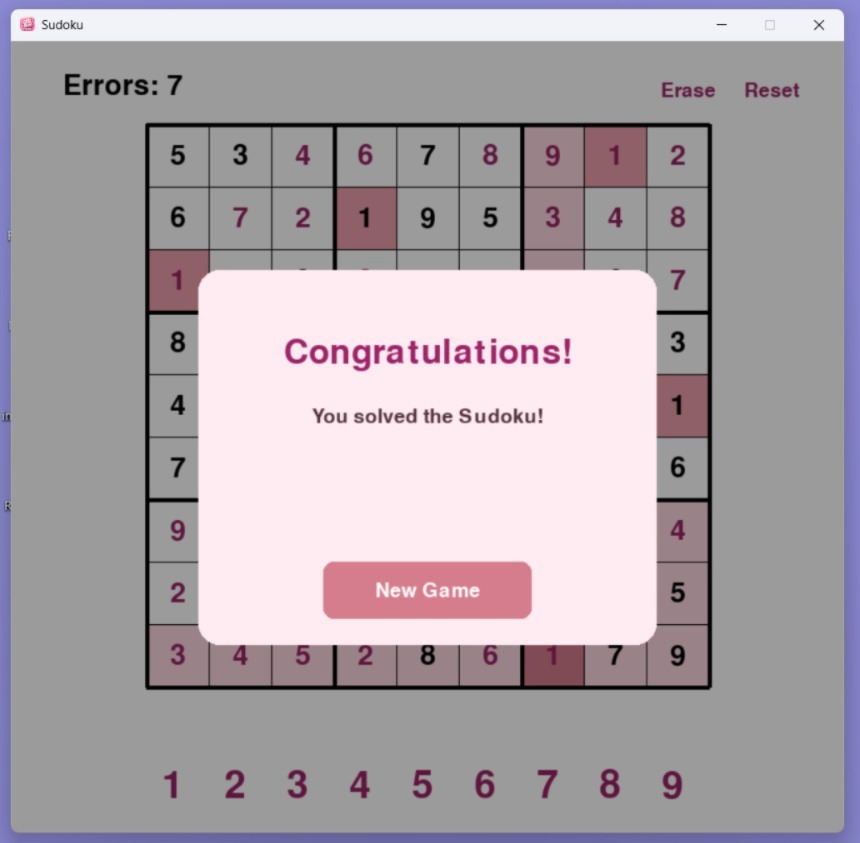

# Sudoku Game
A GUI-based Sudoku game built using Python and Pygame.

## Features
- Interactive 9×9 Sudoku board
- Mouse and keyboard input
- Error tracking for incorrect answers
- Highlights selected cell, row, column, and 3×3 box
- Highlights matching numbers
- Erase button for user-entered numbers
- Reset button to restart the puzzle
- Congratulations message when the puzzle is completed
- Custom Sudoku app icon

## Technologies Used
- Python
- Pygame

## Game Screenshots

### Gameplay


### Highlight Blocks


### Game Completion



## How to Run
1. Install Python.
2. Install Pygame:

```bash
pip install pygame
```

3. Run the game:

```bash
python MySudoku.py
```
